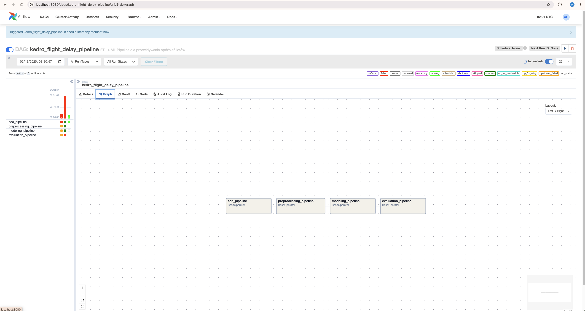
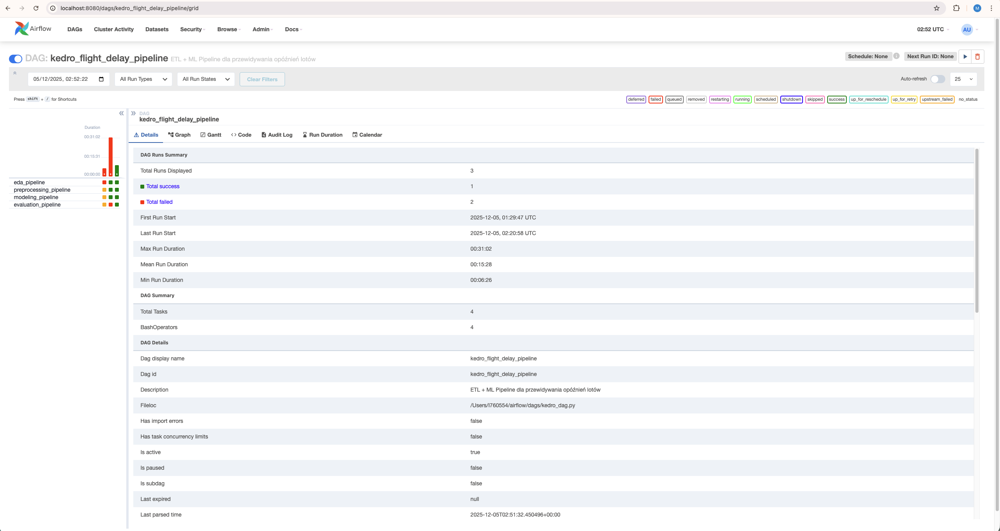
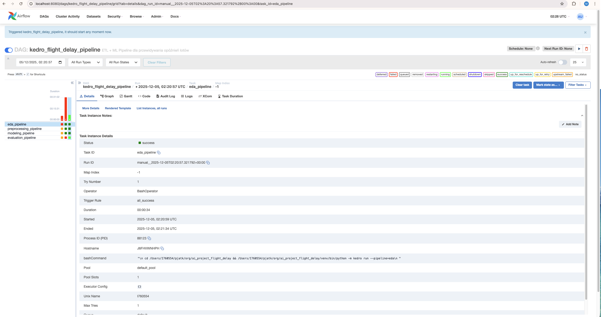

# Raport Airflow - Automatyzacja Pipeline'ów Kedro

**Projekt:** Flight Delay Prediction  
**Data:** 5 grudnia 2025

---

## 1. Struktura DAG-a i zależności między pipeline'ami

### 1.1 Definicja DAG-a

**Nazwa:** `kedro_flight_delay_pipeline`

**Parametry:**
- `schedule_interval`: None (manualne uruchamianie)
- `start_date`: 2025-01-01
- `catchup`: False
- `retries`: 1

### 1.2 Zależności między pipeline'ami

Pipeline'y wykonują się sekwencyjnie w następującej kolejności:

```
eda_pipeline 
    ↓
preprocessing_pipeline 
    ↓
modeling_pipeline 
    ↓
evaluation_pipeline
```

Każdy task używa `BashOperator` wykonującego komendę:
```bash
cd /Users/I760554/pjatk/org/ai_project_flight_delay && \
/Users/I760554/pjatk/org/ai_project_flight_delay/venv/bin/python -m kedro run --pipeline=<nazwa>
```

**Kluczowe elementy:**
- Każdy następny pipeline uruchamia się dopiero po sukcesie poprzedniego
- Operator `>>` definiuje zależności (dependencies)
- BashOperator umożliwia uruchomienie komend Kedro z poziomu Airflow

---

## 2. Zrzuty ekranu z interfejsu Airflow

### 2.1 DAG Graph View



*Rysunek 1: Graf przedstawiający zależności między taskami. Strzałki pokazują kolejność wykonywania pipeline'ów.*

### 2.2 Tree View / Grid View



*Rysunek 2: Historia uruchomień DAG-a z kodami kolorów:*
- Zielony - Success (task zakończony sukcesem)
- Czerwony - Failed (task zakończony błędem)
- Niebieski - Running (task w trakcie wykonywania)

### 2.3 Logi z wykonania



*Rysunek 3: Przykład logów z pomyślnie wykonanego taska*


*Rysunek 4: Przykład błędu napotkany podczas wykonywania*

---

## 3. Logi i błędy napotkane podczas uruchamiania

### 3.1 Błąd #1: Brak pakietu kedro-datasets

**Komunikat błędu:**
```
DatasetError: Dataset 'CSVDataset' not found in 'pandas'
```

**Przyczyna:**  
Brak zainstalowanego pakietu `kedro-datasets`, który od wersji Kedro 0.19.x jest osobnym pakietem.

**Rozwiązanie:**
```bash
pip install kedro-datasets
```

**Status:** Rozwiązany

---

### 3.2 Błąd #2: Brak połączenia z MLflow

**Komunikat błędu:**
```
MlflowException: API request to http://localhost:5000/api/2.0/mlflow/runs/create failed
ConnectionRefusedError: [Errno 61] Connection refused
```

**Przyczyna:**  
Pipeline evaluation próbował połączyć się z MLflow tracking serverem, który nie był uruchomiony.

**Rozwiązanie:**  
Zakomentowanie node'a `log_mlflow` w pipeline evaluation, ponieważ MLflow nie był wymagany do realizacji zadania.

**Status:** Rozwiązany

---

### 3.3 Statystyki wykonania

Po naprawieniu błędów, wszystkie pipeline'y wykonały się pomyślnie:

| Pipeline | Status | Czas wykonania |
|----------|--------|----------------|
| EDA | Success | ~35s |
| Preprocessing | Success | ~12s |
| Modeling | Success | ~5min |
| Evaluation | Success | ~6min |

**Całkowity czas:** ~8 minut 15 sekund

---

## 4. Wnioski i pomysły na usprawnienia

### 4.1 Wnioski

1. **Integracja Airflow + Kedro działa poprawnie**  
   Wszystkie pipeline'y Kedro uruchamiają się bez problemów z poziomu Airflow.

2. **Monitoring w czasie rzeczywistym**  
   Airflow UI dostarcza przejrzysty widok statusów tasków i szczegółowe logi.

3. **Retry mechanism zwiększa niezawodność**  
   Automatyczne ponowienie w przypadku przejściowych błędów.

### 4.2 Usprawnienia

#### **1. Automatyczny retraining**

**Propozycja:**
```python
schedule_interval="0 2 * * 1"  # Każdy poniedziałek o 2:00
```

**Uzasadnienie:**  
Cotygodniowy automatyczny retraining modelu pozwoli na adaptację do zmieniających się wzorców w danych (sezonowość, nowe trasy lotnicze).

---

#### **2. Notyfikacje o statusie**

**Propozycja:** Integracja ze Slackiem lub emailem

**Przykład (Slack):**
```python
from airflow.providers.slack.operators.slack_webhook import SlackWebhookOperator

slack_alert = SlackWebhookOperator(
    task_id='slack_notification',
    http_conn_id='slack_webhook',
    message='Flight Delay Pipeline completed successfully!',
    trigger_rule='all_success'
)

evaluation_task >> slack_alert
```

**Korzyści:**
- Natychmiastowa informacja o zakończeniu pipeline'u
- Alerty w przypadku błędów
- Możliwość integracji z systemami ticketowymi

---

#### **3. Walidacja danych przed preprocessingiem**

**Propozycja:** Dodanie taska sprawdzającego jakość danych

```python
from airflow.operators.python import BranchPythonOperator

def validate_data_quality(**context):
    # Sprawdź: missing values, outliers, schema
    if data_quality_score > 0.9:
        return 'preprocessing_pipeline'
    else:
        return 'send_data_quality_alert'
```

**Korzyści:**
- Zapobieganie trenowaniu modelu na wadliwych danych
- Wczesne wykrywanie problemów z źródłem danych

---

#### **4. Równoległe trenowanie wielu modeli**

**Propozycja:** Parallel execution dla różnych algorytmów

```python
preprocessing_task >> [
    train_random_forest,
    train_xgboost,
    train_lightgbm
] >> select_best_model >> evaluation_task
```

**Korzyści:**
- Skrócenie czasu wykonania
- Automatyczny wybór najlepszego modelu
- Możliwość tworzenia ensembli

---

#### **5. Wersjonowanie modeli**

**Propozycja:** Integracja z MLflow lub DVC

**Implementacja:**
- Uruchomienie MLflow servera (Docker)
- Logowanie metryk i parametrów po każdym treningu
- Model registry do śledzenia wersji produkcyjnych

**Korzyści:**
- Śledzenie historii eksperymentów
- Łatwy rollback do poprzednich wersji
- Porównywanie wydajności modeli w czasie

---

#### **6. Dynamiczne harmonogramowanie**

**Propozycja:** Uruchamianie pipeline'u przy pojawieniu się nowych danych

```python
from airflow.sensors.filesystem import FileSensor

wait_for_new_data = FileSensor(
    task_id='wait_for_data',
    filepath='/path/to/new_data.csv',
    poke_interval=300  # sprawdzaj co 5 minut
)

wait_for_new_data >> eda_task >> ...
```

**Korzyści:**
- Automatyczna reakcja na nowe dane
- Brak potrzeby manualnego triggerowania

---

## 5. Podsumowanie

### Zrealizowane cele ✅

- [x] Instalacja i konfiguracja Apache Airflow
- [x] Integracja Airflow z pipeline'ami Kedro
- [x] Definicja DAG-a z zależnościami EDA → Preprocessing → Modeling → Evaluation
- [x] Monitoring i uruchamianie pipeline'ów
- [x] Dokumentacja z zrzutami ekranu i analizą błędów

### Kluczowe osiągnięcia

1. ✅ Wszystkie 4 pipeline'y Kedro uruchamiają się automatycznie przez Airflow
2. ✅ Zależności między taskami działają poprawnie
3. ✅ Logi są dostępne i czytelne w UI Airflow
4. ✅ System jest gotowy do harmonogramowania automatycznych uruchomień

---

## 6. Struktura projektu

```
ai_project_flight_delay/
│
├── dags/
│   └── kedro_dag.py                    # Definicja DAG-a Airflow
│
├── docs/
│   ├── airflow_report.md               # Ten raport
│   └── screenshots/
│       ├── dag_graph.png
│       ├── tree_view.png
│       ├── task_success.png
│       └── task_failed.png
│
├── src/
│   └── ai_project_flight_delay/
│       ├── pipelines/
│       │   ├── eda/
│       │   ├── preprocessing/
│       │   ├── modeling/
│       │   └── evaluation/
│       └── pipeline_registry.py
│
├── data/                               # Dane w różnych stadiach pipeline'u
└── conf/base/catalog.yml               # Konfiguracja datasetów
```

---

**Koniec raportu**