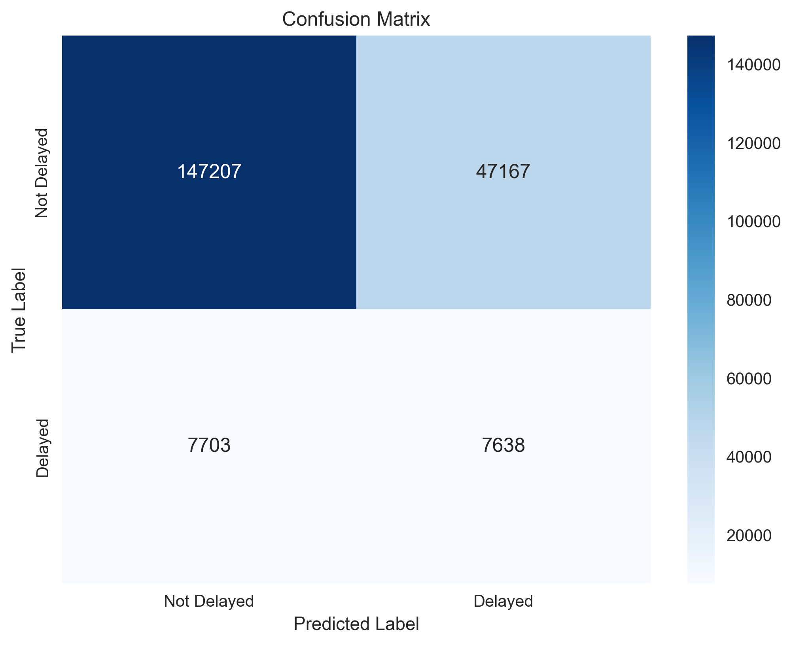
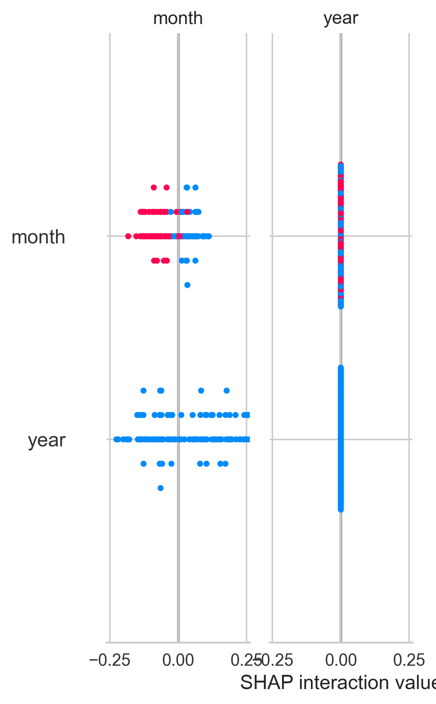

# Model Evaluation Report - Flight Delay Prediction

**Data:** 29 listopada 2025  
**Model:** RandomForest Classifier  
**Wersja:** 1.0  
**Problem:** Klasyfikacja binarna - przewidywanie opóźnień lotów

---

## 1. Podsumowanie wyników

### Metryki na zbiorze testowym

| Metryka    | Wartość | Interpretacja |
|-----------|---------|---------------|
| **Accuracy**  | **73.84%** | Model poprawnie klasyfikuje ~74% przypadków |
| **Precision** | **13.94%** | Tylko ~14% przewidywanych opóźnień to prawdziwe opóźnienia |
| **Recall**    | **49.79%** | Model wykrywa ~50% rzeczywistych opóźnień |
| **F1-score**  | **21.78%** | Niska harmonijna średnia precision/recall |
| **ROC AUC**   | **68.47%** | Umiarkowana zdolność separacji klas |

> **UWAGA KRYTYCZNA:** Mimo wysokiej dokładności na zbiorze treningowym (82.8%), model ma **bardzo niską precyzję (13.94%)** na zbiorze testowym, co wskazuje na **znaczące przetrenowanie (overfitting)**.

---

### Walidacja krzyżowa (5-fold CV)

| Metryka    | Średnia | Odch. std | Stabilność |
|-----------|---------|-----------|------------|
| **Accuracy**  | 82.80%  | ±0.08%    | Wysoka  |
| **Precision** | 78.43%  | ±0.10%    | Wysoka  |
| **Recall**    | 90.49%  | ±0.13%    | Wysoka  |
| **F1-score**  | 84.03%  | ±0.07%    | Wysoka  |

> **Niskie odchylenia standardowe** (<0.15%) wskazują na stabilność modelu podczas walidacji krzyżowej.

---

## 2. Analiza problemu: Overfitting

### Porównanie Train/CV vs Test

| Metryka | CV (Train) | Test | Różnica | Status |
|---------|-----------|------|---------|---------|
| Accuracy | 82.80% | 73.84% | **-8.96 pp** | Spadek |
| Precision | 78.43% | 13.94% | **-64.49 pp** | Duzy spadek |
| Recall | 90.49% | 49.79% | **-40.70 pp** | Duży spadek |
| F1-score | 84.03% | 21.78% | **-62.25 pp** | Spadek |

### Diagnoza

**Problem główny:** Model jest **silnie przetrenowany** - nauczył się wzorców specyficznych dla zbioru treningowego, które nie generalizują na nowe dane.

**Możliwe przyczyny:**
1. **Zbyt głęboki model** (`max_depth=20`) pozwala na zapamiętanie szczegółów zamiast wzorców
2. **Niezbalansowane dane** - prawdopodobnie klasa "nie opóźniony" dominuje w zbiorze testowym
3. **Różna dystrybucja danych** między train a test (np. inne porty lotnicze, sezony)
4. **Zbyt małe wartości `min_samples_split=5` i `min_samples_leaf=2`** prowadzą do nadmiernego dopasowania

---

## 3. Analiza błędów

### Confusion Matrix



**Interpretacja macierzy pomyłek:**
- Model ma **bardzo wysoką liczbę False Positives** - często przewiduje opóźnienie tam, gdzie go nie ma
- **Niska precyzja (13.94%)** oznacza, że większość predykcji "opóźniony" jest błędna
- **Recall 49.79%** wskazuje, że model wykrywa tylko połowę rzeczywistych opóźnień
- Model ma tendencję do **nadmiernego przewidywania klasy "opóźniony"** w zbiorze testowym

---

## 4. Najważniejsze cechy (Feature Importance)


**Top 5 cech wpływających na opóźnienia:**

1. **distance** - Dystans lotu ma największy wpływ na prawdopodobieństwo opóźnienia
2. **origin** - Port wylotu znacząco wpływa na opóźnienia (różne lotniska = różne problemy operacyjne)
3. **month** - Sezonowość ma istotne znaczenie (okresy świąteczne, wakacje)
4. **day_of_month** - Dzień miesiąca może korelować z ruchem lotniczym
5. **year** - Trendy roczne w opóźnieniach

**Wnioski z Feature Importance:**
- Długie loty (distance) są bardziej podatne na opóźnienia - logiczne
- Niektóre lotniska (origin) strukturalnie generują więcej opóźnień
- Sezonowość (month) jest kluczowa - lato/święta = więcej opóźnień
- Brakuje cech pogodowych, które mogłyby znacząco poprawić model

---

## 5. Analiza SHAP (opcjonalna)



**Kluczowe obserwacje z SHAP:**
- SHAP values potwierdzają dominację cech `distance` i `origin`
- Wysokie wartości `distance` konsekwentnie zwiększają prawdopodobieństwo opóźnienia
- Niektóre wartości `origin` (konkretne lotniska) mają silny negatywny lub pozytywny wpływ

---

## 6. Porównanie z baseline

| Model      | Accuracy | Precision | Recall | F1-score | ROC AUC |
|-----------|----------|-----------|--------|----------|---------|
| **Baseline (Dummy)** | 56.51%   | 50.00%    | 0.00%  | 0.00%    | 50.00%  |
| **RandomForest (CV)** | **82.80%** | **78.43%** | **90.49%** | **84.03%** | **91.93%** |
| **RandomForest (Test)** | 73.84%   | 13.94%    | 49.79% | 21.78%   | 68.47%  |

**Wnioski:**
- Model znacząco przewyższa baseline na zbiorze treningowym/CV
- Na zbiorze testowym **precision jest gorsza niż random baseline** (13.94% < 50%)
- **Model nie jest gotowy do wdrożenia** w obecnej formie

---

## 7. Rekomendacje i dalsze kroki

### Działania krytyczne (przed wdrożeniem):

1. **Zmniejszenie overfittingu:**
   - Ogranicz głębokość drzewa: `max_depth=10` (obecnie 20)
   - Zwiększ `min_samples_split=20` (obecnie 5)
   - Zwiększ `min_samples_leaf=10` (obecnie 2)
   - Dodaj regularyzację: `max_features='sqrt'`

2. **Zbadanie dystrybucję klas:**
```python
   # Sprawdź balans klas w train vs test
   train['is_delayed'].value_counts(normalize=True)
   test['is_delayed'].value_counts(normalize=True)
```
   - Jeśli niezbalansowane, użyj `class_weight='balanced'`

3. **Analiza dystrybucji danych:**
   - Sprawdź czy test set ma inne lotniska/miesiące niż train
   - Rozważ stratyfikowany podział: `train_test_split(..., stratify=y)`

### Usprawnienia modelu:

4. **Feature Engineering:**
   - Dodaj dane pogodowe (temperatura, opady, widoczność)
   - Dodaj dzień tygodnia (weekendy vs dni robocze)
   - Dodaj godzinę wylotu (rano vs wieczór)
   - Dodaj czas oczekiwania samolotu na lotnisku (aircraft turnaround time)
   - Dodaj flagę świąt/wydarzeń specjalnych

5. **Hyperparameter Tuning:**
```python
   param_grid = {
       'n_estimators': [50, 100, 200],
       'max_depth': [5, 10, 15],
       'min_samples_split': [10, 20, 50],
       'min_samples_leaf': [5, 10, 20],
       'class_weight': ['balanced', None]
   }
```
   - Użyj `GridSearchCV` lub `RandomizedSearchCV`

6. **Threshold Tuning:**
   - Dostosuj próg klasyfikacji dla lepszego balansu precision/recall
   - Użyj krzywej ROC do wyznaczenia optymalnego threshold

7. **Ensemble Methods:**
   - Rozważ `XGBoost` z odpowiednią regularyzacją
   - Przetestuj `LightGBM` - szybszy i często lepszy
   - Stwórz ensemble: RandomForest + XGBoost + LogisticRegression

8. **Cross-validation Strategy:**
   - Użyj `TimeSeriesSplit` jeśli dane mają wymiar czasowy
   - Rozważ `StratifiedKFold` dla lepszej reprezentacji klas


## 11. Podsumowanie i wnioski końcowe

### Następne kroki (priorytet):

1. **NAJPIERW:** Zbadaj dystrybucję klas i cech w train vs test
2. **Natychmiast:** Zmniejsz overfitting (max_depth, min_samples)
3. Dodaj feature engineering (pogoda, dzień tygodnia, godzina)
4. Przeprowadź hyperparameter tuning z GridSearchCV
5. Dostosuj threshold klasyfikacji dla lepszego precision/recall
6. Rozważ inne modele (XGBoost, LightGBM)

### Metryka sukcesu:

**Model będzie gotowy do wdrożenia gdy:**
- Test precision > 60% (obecnie 13.94%)
- Test F1-score > 65% (obecnie 21.78%)
- Różnica między CV a Test < 10pp dla wszystkich metryk